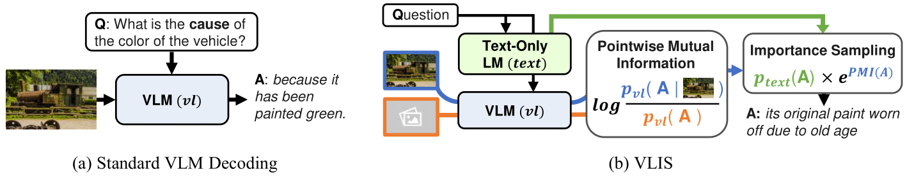
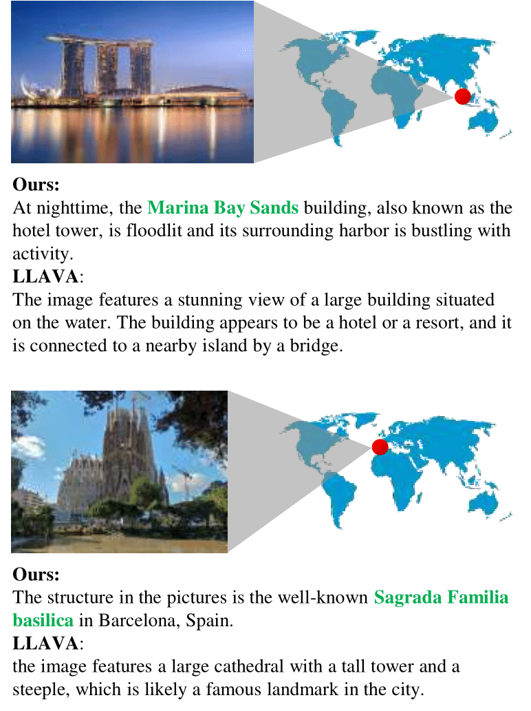

# VLIS: Unimodal Language Models Guide Multimodal Language Generation

This repository contains the code for our EMNLP 2023 paper:
***VLIS: Unimodal Language Models Guide Multimodal Language Generation*** <br>
Jiwan Chung, Youngjae Yu <br>



Paper & Presentation slides (tbu)

# VLIS per backbone models

VLIS is a decoding-time method agnostic of the backbone model.
We support inference UI code for three difference recent vision-language backbones:
[BLIP-2](https://arxiv.org/abs/2301.12597), [LLAVA](https://llava-vl.github.io/), and [Lynx](https://github.com/bytedance/lynx-llm)

## Preparation

For python dependencies, we provide two options:
- A monolithic conda environment for all models (`conda env create -f env.yaml`).
- Per-model `requirements.txt` file.

Other than that, please look into per-model instructions (e.g. `code/blip2/PREPARATION.md`) for preparation.

## Usage

Use the provided UI script to test VLIS per backbone.

For example, when using VLIS with LLaVA:

```
code code/llava
python ui.py --lm_name 'lmsys/vicuna-7b-v1.5'
```

The Gradio UI supports widely used text generation hyperparameters, including `temperature, num_beams, top_p, max_length`.

It would be straightforward to convert the given UI code into an offline script for data evaluation.
If you want inference script for a particular dataset, please feel free to open an issue.

# Landmark and Character benchmarks

<p align="center">
    
</p>

We assess visual specificity of visual-language models on named entity in appendix A of our paper.
Here, we provide the data and evaluation code to replicate our experiments.

## Preparation

Use `code/data/character_urls.json` and `code/data/landmark_urls.json` to download the images, respectively.

## Evaluation

The model generated output files should be structured as follows:

```
OUTPUT_FILE

{
  DATA_ID: {
    MODELNAME: OUTPUT
  }
}
```

We provide example output files in `code/data/example_landmark.json`.
Then, run the evaluation script to get the statistics.

```
python code/data/landmark_eval.py --path OUTPUT_FILE
```

# Contact

[Jiwan Chung: jiwan.chung.research@gmail.com](jiwan.chung.research@gmail.com)
